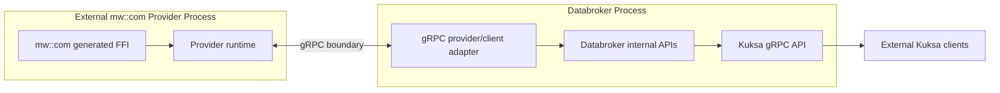

<!--
/********************************************************************************
 * Copyright (c) 2026 Contributors to the Eclipse Foundation
 *
 * See the NOTICE file(s) distributed with this work for additional
 * information regarding copyright ownership.
 *
 * This program and the accompanying materials are made available under the
 * terms of the Apache License Version 2.0 which is available at
 * https://www.apache.org/licenses/LICENSE-2.0
 *
 * SPDX-License-Identifier: Apache-2.0
 ********************************************************************************/
-->

# ADR 0001: Use Rust Traits for In-Process Provider Boundaries

## Status

Accepted for initial skeleton.

## Context

The `mw_com_provider` crate is designed as an in-process Databroker provider. It is compiled into the Rust workspace and uses Databroker's internal provider contracts to register externally supplied VSS datapoints and actuator targets.

The crate has two relevant boundaries:

- the Databroker integration boundary, implemented through Databroker's internal Rust `SignalProvider` and `ActuationProvider` traits;
- the middleware transport boundary, implemented through the crate-local `MwComTransport` trait.

An alternative design would place a gRPC service boundary between the mw::com provider and Databroker. That would make the provider a separate process or sidecar service, but it would also duplicate part of Databroker's existing provider contract and add serialization, transport, lifecycle, and deployment overhead.

## Decision

Use Rust traits for in-process provider integration and middleware abstraction:

- keep `MwComProvider` inside the Databroker process for the current implementation;
- use Databroker's `SignalProvider` and `ActuationProvider` traits for provider registration and actuator dispatch;
- use the crate-local `MwComTransport` trait to isolate generated mw::com FFI code from Databroker-facing logic;
- keep Kuksa gRPC as the public client API of Databroker, not as the internal boundary between this provider and Databroker.

Use gRPC only if the mw::com provider must become an out-of-process component, such as a standalone sidecar, a provider running on a different ECU, or a language-neutral integration service.

## Decision Criteria

| Criterion | Rust trait boundary | gRPC boundary | Preferred for current crate |
| --- | --- | --- | --- |
| Provider runs in the same Databroker process | Native fit | Adds unnecessary network/service layer | Rust trait |
| Provider runs outside Databroker | Not suitable across process boundary | Native fit | gRPC |
| Generated mw::com FFI isolation | Good through `MwComTransport` | Possible, but requires protobuf/service model | Rust trait |
| Direct access to Databroker internal APIs | Good | Requires translation layer | Rust trait |
| Cross-language provider implementation | Rust-only | Good | gRPC |
| Remote ECU/container deployment | Not suitable | Good | gRPC |
| Low-latency datapoint update path | Good, no serialization boundary | Higher overhead due to serialization and transport | Rust trait |
| Unit testing with mock transport | Simple | Requires client/server test harness or mocked gRPC | Rust trait |
| Independent provider restart/upgrade | Coupled to Databroker process | Good | gRPC |
| Public interoperability API | Not appropriate | Good | gRPC |
| Consistency with IEEE1722 in-process provider pattern | Good | Different pattern | Rust trait |

Summary:

| Use Rust traits when | Use gRPC when |
| --- | --- |
| The provider is compiled into Databroker. | The provider is deployed as a separate process. |
| Databroker internal APIs are available. | The provider must be language-neutral. |
| The transport is a generated FFI wrapper. | The provider runs on another host, ECU, or container. |
| Mocking and unit testing should stay lightweight. | Independent restart or upgrade is required. |
| Runtime overhead should be minimal. | A stable network API boundary is required. |

## Architecture Pictures

The selected in-process layering keeps gRPC at the public Kuksa API boundary and uses Rust traits inside the Databroker process.


If the provider later becomes a sidecar or remote service, the gRPC boundary moves between Databroker and the provider.



The editable project diagrams are maintained in [../mw_com_provider_lld.drawio](../mw_com_provider_lld.drawio). The full low-level design is documented in [../low-level-design.md](../low-level-design.md).

## Rationale

Rust traits are the better fit for the current provider because they provide:

- direct access to Databroker's internal provider APIs;
- low overhead for datapoint updates and actuator callbacks;
- straightforward unit testing through mock transport implementations;
- a narrow boundary around generated mw::com bindings;
- simpler startup and shutdown behavior than a separate gRPC service.

gRPC remains valuable for public and remote interoperability. It is appropriate when process isolation, remote deployment, cross-language clients, independent restart lifecycle, or network security boundaries are required.

## Consequences

The initial provider remains simple and efficient, but it is coupled to Databroker's internal Rust APIs and must be built with the Databroker workspace. A future out-of-process version would need a separate gRPC contract or reuse an existing Kuksa provider stream API.

The recommended layering is:

```text
mw::com generated FFI
    -> MwComTransport Rust trait
    -> MwComProvider
    -> Databroker internal Rust provider APIs
    -> Kuksa gRPC API for external clients
```

This keeps the generated middleware transport replaceable while avoiding an unnecessary network boundary inside the same process.

## Revisit Criteria

Revisit this decision if any of the following become requirements:

- the provider must run outside the Databroker process;
- the provider must be implemented in a non-Rust language;
- the provider must be independently deployed, restarted, or upgraded;
- middleware access is only available from a separate ECU, container, or process;
- a stable network API is required between Databroker and the provider;
- security policy requires a process or network isolation boundary.