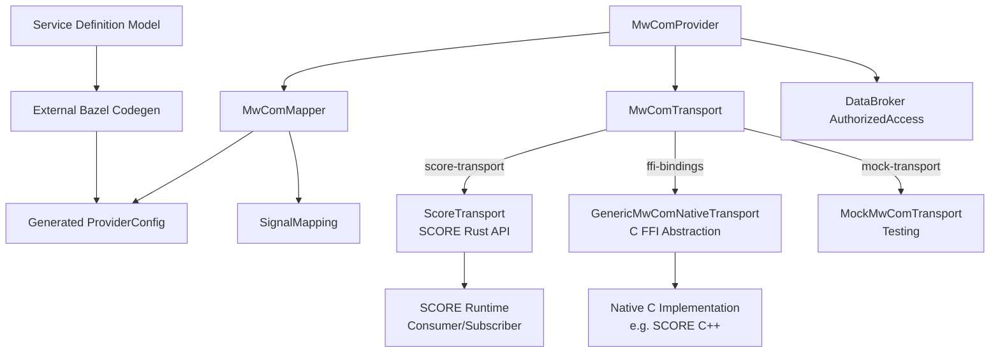
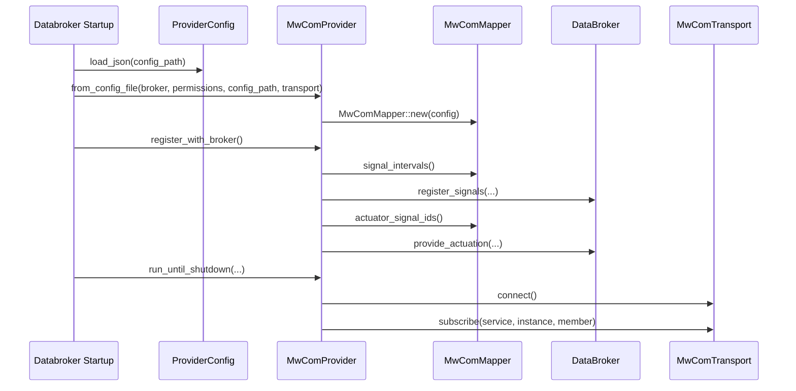
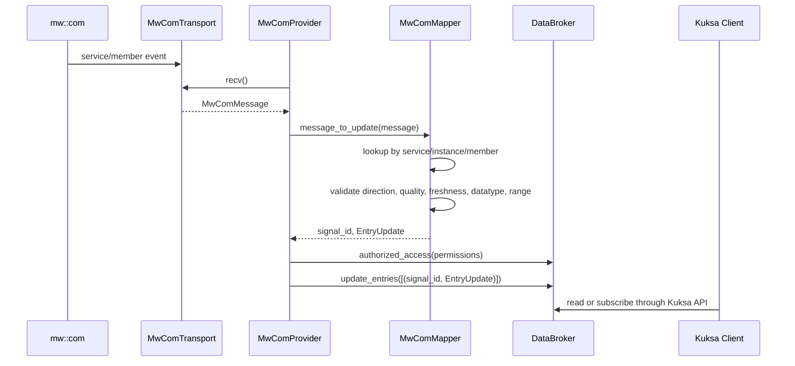
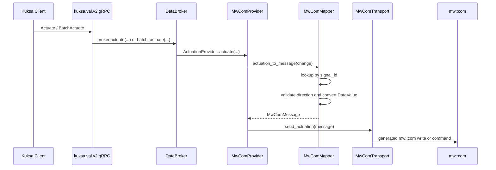
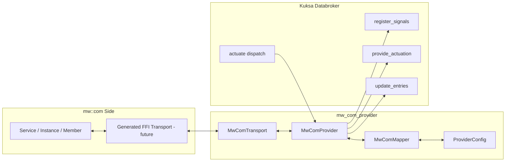

<!--
/********************************************************************************
 * Copyright (c) 2026 Contributors to the Eclipse Foundation
 *
 * See the NOTICE file(s) distributed with this work for additional
 * information regarding copyright ownership.
 *
 * This program and the accompanying materials are made available under the
 * terms of the Apache License Version 2.0 which is available at
 * https://www.apache.org/licenses/LICENSE-2.0
 *
 * SPDX-License-Identifier: Apache-2.0
 ********************************************************************************/
-->

# Low-Level Design

This document describes the `mw_com_provider` crate at implementation level. The editable Draw.io source for these diagrams is [mw_com_provider_lld.drawio](mw_com_provider_lld.drawio).

## Purpose

`mw_com_provider` bridges `mw::com` service data with Kuksa Databroker VSS signals. It follows the existing IEEE1722 provider model: register externally supplied datapoints with Databroker, update Databroker when middleware samples arrive, and receive Databroker actuator callbacks for outbound middleware commands.

### Provider Independence
The provider core is **independent of SCORE** via the `MwComTransport` trait abstraction. Transport implementations can be:
- **SCORE Rust API** (`score-transport` feature): Type-safe wrapper using SCORE's Consumer/Subscriber/Subscription
- **Generic C FFI** (`ffi-bindings` feature): C FFI abstraction usable by any native mw::com implementation  
- **Mock** (`mock-transport` feature): Testing implementation included by default

This design allows the provider to work with any middleware that implements the trait.

## Protocol-Based Transport Implementation

All transport implementations follow a common `MwComTransport` trait interface with three key methods:
- `connect()` - Initialize and connect to middleware
- `subscribe()` - Register interest in service/instance/member
- `recv()` - Asynchronously receive messages with timeout

Each implementation is **protocol-specific**, using the native APIs of its underlying middleware:

### 1. ScoreTransport (SCORE Rust API Protocol)
**Feature:** `score-transport`  
**Protocol:** SCORE's high-level Rust API (Consumer/Subscriber pattern)

```rust
// connect() - Initialize SCORE runtime
let mut builder = LolaRuntimeBuilderImpl::new();
builder.load_config(Path::new("config/score_config.json"));
self.runtime = Some(builder.build()?);

// subscribe() - Create Consumer and Subscription
let consumer = runtime.consumer_builder::<ServiceInterface>(spec).build()?;
let subscription = consumer.member_name.subscribe(3)?;

// recv() - Async receive with cancellable_receive()
let (mut container, _) = subscription.cancellable_receive(
    SampleContainer::new(),
    1,    // Min samples
    3,    // Max samples
    timeout_future
).await?;
let sample = container.pop_front()?;
```

**Advantages:** Type-safe, zero-copy, native async/await  
**Requires:** SCORE Cargo crate (when available)

### 2. GenericMwComNativeTransport (C FFI Protocol)
**Feature:** `ffi-bindings`  
**Protocol:** Generic C FFI abstraction (works with any native C backend)

```rust
// connect() - Call native FFI function
let status = unsafe { mw_com_provider_native_connect(self.handle()) };
status_to_result(status, "connect")?;

// subscribe() - Call native FFI function with C strings
let status = unsafe {
    mw_com_provider_native_subscribe(
        self.handle(),
        service.as_ptr(),
        instance.as_ptr(),
        member.as_ptr()
    )
};

// recv() - Call native FFI with timeout
let status = unsafe {
    mw_com_provider_native_recv(
        self.handle(),
        self.recv_timeout_ms,
        &mut raw_message
    )
};
let message = unsafe { message_from_native(&raw_message) };
```

**Advantages:** Works with any C/C++ middleware, no Rust dependency  
**Requires:** Native C library implementation of 8 FFI functions

### 3. MockMwComTransport (In-Memory Protocol)
**Feature:** `mock-transport` (default)  
**Protocol:** Tokio channels + in-memory queue

```rust
// connect() - No-op, already initialized
Ok(())

// subscribe() - Add to in-memory subscription vector
self.subscriptions.push(SubscriptionInfo { ... });

// recv() - Return from queue or timeout after 5 seconds
if let Some(msg) = self.message_queue.pop() {
    Ok(msg)
} else {
    tokio::time::timeout(Duration::from_secs(5), tokio::task::sleep(...))
        .map_err(|_| MwComProviderError::Transport("timeout".into()))
}
```

**Advantages:** No external dependencies, fast testing  
**Use case:** Unit/integration testing, development

## Feature-Gating Strategy

```bash
# Build with default (mock-transport only)
cargo build

# Build with SCORE Rust API
cargo build --features score-transport

# Build with generic C FFI
cargo build --features ffi-bindings

# All transports available
cargo build --features score-transport,ffi-bindings
```

Each transport is feature-gated, allowing conditional compilation:
```rust
#[cfg(feature = "score-transport")]
pub struct ScoreTransport { ... }

#[cfg(feature = "ffi-bindings")]
pub struct GenericMwComNativeTransport { ... }
```

This ensures unused code isn't compiled when features aren't enabled.



| Component | Responsibility |
| --- | --- |
| `MwComProvider` | Registers with Databroker, runs the receive/reconnect loop, and handles actuator callbacks. |
| `MwComTransport` | Trait boundary for concrete middleware communication implementations. |
| `ScoreTransport` | Type-safe wrapper around SCORE's native Rust API (Consumer, Subscriber, Subscription). Enabled via `score-transport` feature. |
| `GenericMwComNativeTransport` | Generic C FFI abstraction for native middleware implementations. Reusable for any C-based mw::com backend. Enabled via `ffi-bindings` feature. |
| `MockMwComTransport` | Mock implementation for testing. Enabled by default. |
| `MwComMapper` | Converts inbound `MwComMessage` values to Databroker updates and outbound actuator changes to `MwComMessage` values. |
| `ProviderConfig` | Runtime mapping and lifecycle configuration. |
| External codegen model | Generator input describing services, events, and VSS mappings. |

## Startup Sequence



Startup integration points:

- `MwComProvider::from_config_file(...)`
- `MwComProvider::register_with_broker()`
- `MwComProvider::run_until_shutdown(...)`

## Inbound Datapoint Flow



Accepted middleware samples are written through Databroker's internal `update_entries(...)` API. Databroker then stores the last datapoint and notifies relevant subscribers.

## Outbound Actuation Flow



The provider receives actuator commands only because it registers actuator-capable mappings with `provide_actuation(...)` during startup.

## End-to-End Architecture



## Databroker APIs Used

| API | Usage |
| --- | --- |
| `register_signals(...)` | Registers mappings with `datapoint` or `bidirectional` direction. |
| `provide_actuation(...)` | Registers mappings with `actuator` or `bidirectional` direction. |
| `update_entries(...)` | Writes accepted incoming samples to Databroker. |
| `ActuationProvider::actuate(...)` | Callback invoked by Databroker when Kuksa clients write actuator targets. |
| `SignalProvider::update_filter(...)` | Filter callback; currently acknowledged without changing transport subscriptions. |
| `SignalProvider::get_signals_values_from_provider(...)` | Not implemented because this provider is event-driven. |

## Current Implementation Scope

Implemented:

- Databroker provider trait implementations.
- Mapping config model and validation.
- Bidirectional value conversion.
- Quality, freshness, datatype, scale, offset, and range checks.
- Reconnect backoff.
- Mock transport.
- External codegen integration and generated provider configuration.

Pending:

- Real generated `mw::com` FFI transport.
- Databroker binary startup feature and CLI arguments.
- Exported PNG/SVG diagram assets if required by the target publication site.
- Final SPDX/license alignment for upstream contribution.