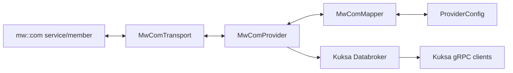

<!--
/********************************************************************************
 * Copyright (c) 2026 Contributors to the Eclipse Foundation
 *
 * See the NOTICE file(s) distributed with this work for additional
 * information regarding copyright ownership.
 *
 * This program and the accompanying materials are made available under the
 * terms of the Apache License Version 2.0 which is available at
 * https://www.apache.org/licenses/LICENSE-2.0
 *
 * SPDX-License-Identifier: Apache-2.0
 ********************************************************************************/
-->

# mw::com Provider for Kuksa Databroker

`mw_com_provider` is a Rust provider crate that bridges S-Core `mw::com` service data with Kuksa Databroker VSS signals. Transport-specific logic is isolated behind a small async trait, incoming middleware samples are mapped to VSS datapoints, and actuator targets from Kuksa clients are mapped back to middleware messages.

The crate contains the Databroker-facing API integration, mapping layer, quality checks, reconnect handling, reference-generated provider metadata/config consumption, mock transport, generated SCORE binding transport, and a feature-gated S-Core LoLa runtime adapter. Default builds remain independent from S-Core so normal provider tests stay lightweight, while `score-lola` enables the real adapter source when the S-Core checkout and runtime dependencies are available.

## Architecture



Editable Draw.io diagrams are available in [docs/mw_com_provider_lld.drawio](docs/mw_com_provider_lld.drawio). The file contains these pages:

- Component Block Diagram
- Startup Sequence
- Inbound Datapoint Flow
- Outbound Actuation Flow
- End-to-End Architecture
- Code-Level Startup Behavior
- Config-Code Generation User Flow
- Code-Level Startup Behavior - S-Core LoLa
- Config-Code Generation - S-Core Bindings

The same flows are described in [docs/low-level-design.md](docs/low-level-design.md).

## Project Structure

```text
mw_com_provider/
├── Cargo.toml
├── MODULE.bazel
├── BUILD.bazel
├── README.md
├── build.rs
├── bazel/
│   ├── mw_com_provider.bzl
│   └── cargo/
│       └── third_party.Cargo.toml
├── generated/
│   ├── files.json
│   ├── mw_com_provider_config.json
│   ├── mw_com_provider_instances.rs
│   ├── mw_com_provider_interfaces.rs
│   ├── mw_com_provider_metadata.rs
│   └── mw_com_provider_types.rs
├── models/
│   └── vehicle_dynamics.json
├── templates/
│   └── reference-codegen/
├── xtask/
│   └── src/
├── native/
│   ├── mw_com_native_bridge.h
│   └── mw_com_native_bridge.cpp
├── src/
│   ├── lib.rs
│   ├── provider.rs
│   ├── transport.rs
│   ├── native_bridge.rs
│   ├── mapper.rs
│   ├── config.rs
│   ├── lifecycle.rs
│   ├── quality.rs
│   ├── score_bindings.rs
│   ├── bindings.rs
│   └── error.rs
└── docs/
		├── folder-structure.md
		├── bazel-toolchain.md
		├── low-level-design.md
		├── mw_com_provider_lld.drawio
		├── samples.md
		└── startup.md
```

See [docs/folder-structure.md](docs/folder-structure.md) for the responsibility of each file. The Bazel integration entry point is described in [docs/bazel-toolchain.md](docs/bazel-toolchain.md).

## Databroker Integration

The provider uses Databroker's internal Rust provider contracts:

- `SignalProvider` for externally supplied VSS datapoints.
- `ActuationProvider` for actuator targets that must be sent to middleware.
- `register_signals(...)` to register datapoint or bidirectional mappings.
- `provide_actuation(...)` to register actuator or bidirectional mappings.
- `update_entries(...)` to write accepted middleware samples into Databroker.

Inbound datapoint flow:

```text
mw::com event
		-> MwComTransport::recv
		-> MwComMapper::message_to_update
		-> DataBroker::update_entries
		-> Kuksa clients read or subscribe to VSS data
```

Outbound actuation flow:

```text
Kuksa Actuate / BatchActuate
		-> DataBroker::actuate / batch_actuate
		-> MwComProvider::actuate
		-> MwComMapper::actuation_to_message
		-> MwComTransport::send_actuation
		-> mw::com service/member
```

## Build

This crate depends on Databroker internal Rust APIs. For a standalone checkout, place a compatible Kuksa Databroker repository checkout next to this repository so the manifest path dependency resolves:

```text
Inisetup/
├── kuksa-databroker/  # full Kuksa Databroker repository checkout
│   └── databroker/    # Databroker Rust package used by this crate
└── mw_com_provider/
```

Run a package check from this repository root:

```console
cargo check
```

## Ubuntu 24.04 Dev Container

The repository includes a VS Code dev container in [.devcontainer/devcontainer.json](.devcontainer/devcontainer.json). It runs Ubuntu 24.04 and mounts `/home/pmj3kor/score` at the same path inside the container so the existing Databroker and S-Core relative path dependencies continue to resolve.

Open the repo in VS Code and run **Dev Containers: Reopen in Container**. The container also mounts `/mnt/c`, so the local S-Core communication checkout configured in [MODULE.bazel](MODULE.bazel) is available inside the container.

Inside the dev container, run the live E2E test through Bazel:

```console
cd /home/pmj3kor/score/mwcom_provider_M1/Inisetup/mw_com_provider

bazel run //:score_lola_live_e2e
```

The provider E2E process stays alive until it observes 25 changed speed values by default. Pass a sample count only when a shorter or longer run is needed.

```console
SCORE_E2E_SAMPLE_COUNT=50 \
SCORE_E2E_TIMEOUT_SECS=60 \
bazel run //:score_lola_live_e2e
```

Use [scripts/run-score-lola-live-e2e.sh](scripts/run-score-lola-live-e2e.sh) only when running from a non-Ubuntu-24 host and staging into an existing Ubuntu 24 container such as `loving_payne`.

Run package tests:

```console
cargo test
```

The Bazel entry point keeps Databroker and provider compilation in Cargo while giving integration flows a Bazel-facing command surface:

```console
bazel run //:cargo_check_mw_com_provider
bazel run //:cargo_test_mw_com_provider

bazel run //:score_lola_live_e2e
```

The live LoLa E2E waits for 25 changed `Vehicle.Speed` samples by default. Override `SCORE_E2E_SAMPLE_COUNT` when a shorter or longer sampling run is needed.

The integration test `e2e_stubbed_score` runs the provider against an in-memory Databroker and a stubbed S-CORE `mw::com` application implemented with the mock transport. It verifies both directions of the placeholder flow:

- stubbed S-CORE sample -> provider -> Databroker VSS datapoint
- Databroker actuation -> provider -> stubbed S-CORE command

Run the same core checks used by CI:

```console
cargo fmt --package mw_com_provider --check
cargo test -p mw_com_provider
MW_COM_NATIVE_BUILD_BRIDGE=1 cargo check --features mw-com-native
```

The CI workflow also runs codegen verification when `MW_COM_CODEGEN_GIT_URL` is configured for the repository.

Generate provider artifacts with the reference SCORE config code generator:

```console
cargo run -p xtask -- codegen
```

By default, `xtask` reads `models/vehicle_dynamics.json`, uses `templates/reference-codegen/`, and writes into `generated/`. To generate from a product-specific model, pass an explicit model path:

```console
cargo run -p xtask -- codegen --model /path/to/model.json
```

If the reference SCORE config generator is already checked out elsewhere, set `MW_COM_CODEGEN_ROOT` or pass `--codegen-root`. If it is not checked out, `xtask` can clone it into `target/xtask/` when a Git URL is provided:

```console
MW_COM_CODEGEN_GIT_URL=<reference-codegen-git-url> \
cargo run -p xtask -- codegen
```

Use `MW_COM_CODEGEN_GIT_REF` or `--codegen-ref` to pin a branch, tag, or commit after cloning.

The reference generator writes:

- `generated/mw_com_provider_metadata.rs`, consumed by the crate build.
- `generated/mw_com_provider_config.json`, usable as runtime `ProviderConfig` input.
- `generated/mw_com_provider_types.rs`, generated SCORE payload structs with `CommData`/`Reloc` derives.
- `generated/mw_com_provider_interfaces.rs`, generated `score_com::interface!` declarations.
- `generated/mw_com_provider_instances.rs`, generated SCORE instance specifier constants.

The build script copies `generated/mw_com_provider_metadata.rs` into Cargo `OUT_DIR` so [src/lib.rs](src/lib.rs) can include it as `generated`. Set `MW_COM_PROVIDER_METADATA_RS` only when consuming a different generated metadata file.

## SCORE Binding Integration

The long-term SCORE integration path is split into two layers:

- The provider crate owns the stable Databroker-facing runtime, generic generated metadata, and [src/score_bindings.rs](src/score_bindings.rs).
- A SCORE adapter owns direct dependencies on `score_com`, `score_com_concept`, `com-api-runtime-lola`, `bridge_ffi_lola`, and native Bazel artifacts.

`ScoreBindingTransport<A>` implements `MwComTransport` by resolving every `(service, instance, member)` through generated metadata and delegating runtime work to a `ScoreRuntimeAdapter`. A real adapter should use the high-level S-Core Rust API: initialize `LolaRuntimeBuilderImpl`, call `find_service::<GeneratedInterface>()`, create typed consumers/subscribers for inbound events, and use typed producers/publishers for actuation. It should not duplicate low-level sample pointer ownership logic from the S-Core runtime crates.

This keeps normal `cargo check` and mock tests independent from S-Core checkout layout while still making the SCORE-specific binding contract explicit and generated.

Run the terminal E2E demo with:

```console
cargo run --example score_bindings_demo
```

The demo uses the real provider and Databroker APIs plus a small demo `ScoreRuntimeAdapter`. It prints the generated SCORE bindings, publishes a SCORE-side speed sample into Databroker, actuates target speed and cruise-control enabled through Databroker, and prints the outbound SCORE messages. A LoLa-backed adapter can replace the demo adapter once the S-Core Bazel/native runtime artifact bundle is available.

For a visual walkthrough of the same receive and actuator paths, open [docs/e2e-demo.html](docs/e2e-demo.html). The page animates S-Core mw::com lower layers, `mw_com_provider`, Kuksa Databroker, and the application side. It includes selectable signal and actuator values, validation checkpoints, an ingress/egress event console, and a separate startup/code-flow terminal that traces provider initialization through ingress and egress handling.

## Features

| Feature | Default | Description |
| --- | --- | --- |
| `mock-transport` | Yes | Enables the in-memory mock transport used for tests and skeleton validation. |
| `mw-com-native` | No | Enables the Rust native bridge transport adapter for mw::com `GenericProxy` / `GenericSkeleton` bridge libraries. |
| `score-lola` | No | Enables the real S-Core LoLa adapter source through the local `score_com_cargo` bridge manifests. Requires sibling S-Core `communication` and `baselibs` checkouts. |

## SCORE LoLa Adapter

The `score-lola` feature exposes `LolaScoreRuntimeAdapter`, a real implementation of `ScoreRuntimeAdapter` for the generated `VehicleDynamicsService` bindings. It uses the same S-Core Rust API pattern as `score/mw/com/example/com-api-example`: `LolaRuntimeBuilderImpl`, typed service discovery, typed subscribers, and typed producers/publishers.

The adapter source is generated into [generated/mw_com_provider_lola_adapter.rs](generated/mw_com_provider_lola_adapter.rs) from [templates/reference-codegen/mw_com_provider_lola_adapter.rs.jinja](templates/reference-codegen/mw_com_provider_lola_adapter.rs.jinja). For local Cargo builds, [score_com_cargo](score_com_cargo) contains thin manifests over the existing S-Core Rust sources and baselibs checkout. They expect this sibling layout:

```text
score/
├── info/
│   ├── baselibs/baselibs/
│   └── mwcom/communication/
└── mwcom_provider_M1/Inisetup/mw_com_provider/
```

Validate the adapter compile path with:

```console
cargo check --features score-lola
cargo test -p mw_com_provider --features score-lola --no-run
```

The delivery runner is available as `mw_com_provider` when built with `score-lola`:

```console
cargo build -p mw_com_provider --features score-lola --bin mw_com_provider
target/debug/mw_com_provider \
	--provider-config generated/mw_com_provider_config.json \
	--score-config generated/vehicle_dynamics_lola_config.json
```

Use `--seed-databroker-metadata` only for standalone E2E runs with an in-process Databroker. Production Databroker integration should use the metadata owned by the Databroker deployment.

For the validated Ubuntu 24 live E2E path and the combined provider/S-Core codegen workflow, see [docs/score-lola-integration-runbook.md](docs/score-lola-integration-runbook.md). For remaining production delivery criteria, see [docs/provider-production-readiness.md](docs/provider-production-readiness.md).

Running against a real LoLa runtime still requires a matching S-Core configuration and the generated C++ registration/native LoLa libraries for the selected service model. The bridge manifests are intentionally not the owner of S-Core's internal unit tests; use package-scoped provider checks unless those Bazel-only S-Core test dependencies are also exposed to Cargo.

The provider functionality has been verified through the package E2E demo and tests. The additional Bazel LoLa runtime execution is an environment-dependent qualification step for live S-Core runtime behavior, not a prerequisite for validating the provider mapping, generated binding contract, Databroker update path, or Databroker-to-SCORE actuation path.

## mw::com Native Bridge Adapter

The `mw-com-native` feature exposes `GenericMwComNativeTransport`, an implementation of `MwComTransport` that calls a narrow C ABI. The ABI is declared in `native/mw_com_native_bridge.h` and is designed to be implemented by a C++ bridge using mw::com APIs:

- `GenericProxy::Create(...)`, `GetEvents()`, `GenericProxyEvent::GetNewSamples(...)`, `GetSampleSize()`, and `HasSerializedFormat()` for inbound samples.
- `GenericSkeleton::Create(...)`, `GenericSkeletonServiceElementInfo`, `EventInfo`, `DataTypeMetaInfo`, `OfferService()`, `GenericSkeletonEvent::Allocate()`, and `Send(...)` for outbound publishing.

Build-time environment variables:

```console
MW_COM_NATIVE_LIB_DIR=/path/to/native/libs \
MW_COM_NATIVE_LIBS=mw_com_provider_bridge,mw_com \
cargo check --features mw-com-native
```

For local ABI validation, the repository also contains a compilable stub bridge:

```console
MW_COM_NATIVE_BUILD_BRIDGE=1 cargo check --features mw-com-native
```

That stub validates the Rust/C ABI shape but deliberately returns `MW_COM_PROVIDER_NATIVE_UNSUPPORTED` for real mw::com operations. Production integration should replace or extend `native/mw_com_native_bridge.cpp` with calls into the platform mw::com runtime.

## Configuration

Runtime VSS bindings are loaded from JSON through `ProviderConfig`. Each mapping connects one VSS signal to one `mw::com` service, instance, and member.

```json
{
	"provider_name": "mw_com_provider",
	"queue_capacity": 256,
	"stale_after_ms": 1000,
	"mappings": [
		{
			"signal_id": 42,
			"vss_path": "Vehicle.Speed",
			"datatype": "double",
			"service": "VehicleSpeedService",
			"instance": "front_vehicle",
			"member": "speed",
			"unit": "km/h",
			"scale": 3.6,
			"offset": 0.0,
			"min": 0.0,
			"max": 300.0,
			"required_quality": "valid",
			"direction": "datapoint",
			"cycle_time_ms": 100
		}
	]
}
```

More examples are available in [docs/samples.md](docs/samples.md).
